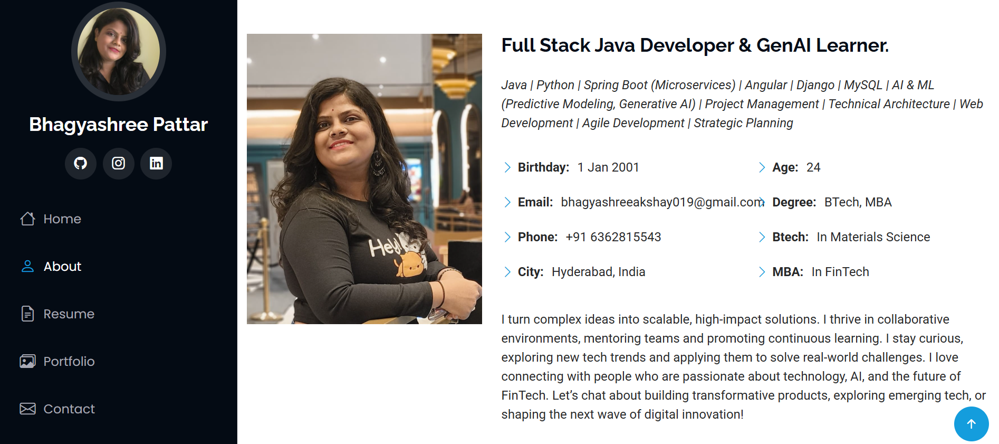

## Hi there 👋

<!--
**BhagyashreeMP/BhagyashreeMP** is a ✨ _special_ ✨ repository because its `README.md` (this file) appears on your GitHub profile.

Here are some ideas to get you started:

- 🔭 I’m currently working on ...
- 🌱 I’m currently learning ...
- 👯 I’m looking to collaborate on ...
- 🤔 I’m looking for help with ...
- 💬 Ask me about ...
- 📫 How to reach me: ...
- 😄 Pronouns: ...
- ⚡ Fun fact: ...
-->
# Welcome to My GitHub Profile Blog!

## About Me
I am Bhagyashree, a Technical Lead. A real enthusiast coder also interested in mentoring and I hope that one of my projects helps you solve a problem or learn something new. Here on my GitHub profile, you'll find a collection of articles, projects, and resources related to Java, Spring boot, Devops,Machine Learning and Generative Ai.

## 🔗 Live Preview
Portfolio Link: https://bhagyashreemp.github.io/Portfolio/

## Projects
### 1. [SpringBoot-openAi](https://github.com/BhagyashreeMP/SpringBoot-openAi)
- SpringBoot-openAi is a Spring Boot application that integrates OpenAPI for generating interactive API documentation. It provides a robust platform for building secure and well-documented Java applications with features including JWT authentication, RESTful endpoints, and comprehensive exception handling.

### 2. [NewsValidator-MachineLearningProject](https://github.com/BhagyashreeMP/NewsValidator-MachineLearningProject)
- This is a machine learning project aimed at validating news using a RandomForestClassifier. The project leverages text data from news articles to build a binary classification model capable of distinguishing between real and fake news.

### 3. [WeddingPlanners-SpringBootProject](https://github.com/BhagyashreeMP/WeddingPlanners-SpringBootProject)
- The WeddingPlanners-SpringBootProject is a comprehensive web application designed to streamline wedding planning and organization. It offers a range of features including guest list management, event scheduling, budget tracking, and vendor coordination. Built with Spring Boot for robust backend functionality, Angular for a dynamic frontend experience, and MySQL for reliable data storage, this project provides a scalable and efficient solution for wedding planning.

### 4. [FrontEndProjects](https://github.com/BhagyashreeMP/FrontEndProjects)
- This has a collection of front-end projects! Each project demonstrates various web development skills, showcasing responsive design, modern technologies, and interactive features. Explore the descriptions below to get an overview of each project.

## Contact Me
- [Email](mailto:bhagyashreeakshay019@gmail.com)
- [LinkedIn](https://www.linkedin.com/in/bhagyashree-mahadev-pattar-365183158?utm_source=share&utm_campaign=share_via&utm_content=profile&utm_medium=android_app)

Feel free to explore my GitHub repositories and reach out to me if you have any questions or collaboration ideas!

